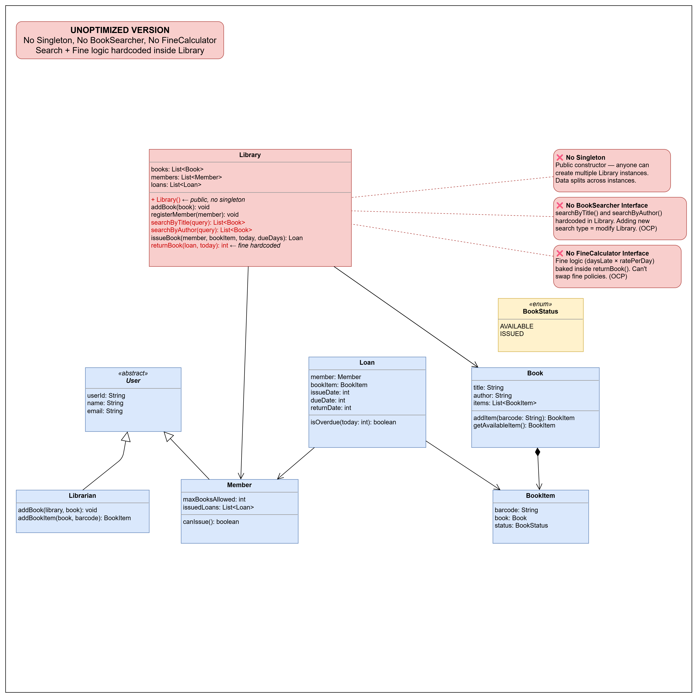
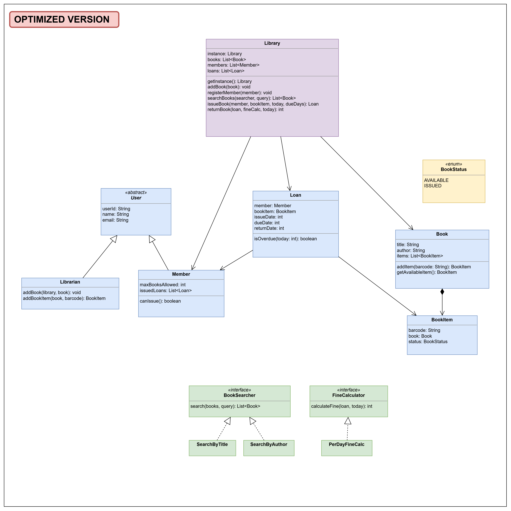

# How LLD Interviews Actually Work — Step-by-Step Approach

> **Prerequisites:** SOLID Principles, UML Class Diagrams

---

## Section 1: What Does "Design X" Actually Mean?

When an interviewer says "Design Zomato" or "Design Uber" — they're NOT asking you to build the whole app. No frontend, no database, no APIs, no deployment.

**Where does LLD fit?** Most applications have layers:

```
┌─────────────────────────────────┐
│  Presentation Layer (UI)        │  ← React, Android, HTML
│  What the user sees and clicks  │
├─────────────────────────────────┤
│  API Layer (Controllers)        │  ← REST endpoints, request/response
│  Receives requests, returns data│
├─────────────────────────────────┤
│  Business Logic Layer (Core)    │  ← Classes, rules, relationships  ⬅ THIS IS LLD
│  The actual rules of the system │
├─────────────────────────────────┤
│  Data Layer (Persistence)       │  ← Database, SQL, storage
│  Where data gets saved          │
└─────────────────────────────────┘
```

> **LLD = Business Logic Layer.** This is the middle layer where the real rules live. It doesn't care whether the UI is a website or a mobile app. It doesn't care if you're using MySQL or MongoDB. It's pure logic.
>
> For example in Zomato:
>
> - _Presentation:_ The app screen showing restaurants
> - _API:_ `GET /restaurants?location=Delhi`
> - **Business Logic:** `Restaurant`, `Menu`, `Order`, `DeliveryPartner`, `PaymentStrategy` — who can order what, how delivery is assigned, how payment is calculated ← **this is what you design in LLD**
> - _Data:_ Restaurants table, Orders table in a database

**What they're actually asking:** Design the **core business logic** — the classes, objects, and relationships that model the real-world problem. This is the layer that exists **regardless** of whether you're building a web app, a mobile app, or a CLI.

| They are NOT asking for...         | They ARE asking for...              |
| ---------------------------------- | ----------------------------------- |
| UI / Frontend (Presentation Layer) | Classes that model the domain       |
| REST APIs / endpoints (API Layer)  | Methods that capture business rules |
| Database schema / SQL (Data Layer) | Relationships between objects       |
| Caching, load balancing            | Clean OOP with SOLID principles     |

> Think of it this way: if "Design Uber" is the question, they want you to model `Rider`, `Driver`, `Trip`, `Location`, `PaymentStrategy` — the **core objects and rules**. Not the React app or the Postgres schema.

> **One more thing:** they don't expect the FULL system either. "Design Uber" doesn't mean design surge pricing + driver matching + payments + ratings + chat all in 45 minutes. You clarify scope in Step 1 (requirements), pick 3-4 core features, and design those well.

---

## Section 2: What Interviewers Actually Evaluate

They do NOT expect production-ready code. They evaluate **thought process > code**.

### 4 things interviewers watch for:

1. **Do you ask clarifying questions or just start coding?**
   - Jumping straight to code = red flag
   - Asking "Can a member borrow multiple books?" = green flag

2. **Can you identify entities and relationships?**
   - Can you break down a real-world system into classes?
   - Do you understand has-a vs is-a?

3. **Is your code following good design principles?**
   - Single Responsibility, Open-Closed, etc. (what they already learned)

4. **Can you communicate your decisions?**
   - "I'm using an interface here so we can swap implementations later"
   - NOT just silently writing code

---

## Section 3: The 5-Step Framework (Reusable for ANY LLD Problem)

This framework works for every LLD problem. Save it.

| Step   | What                                     | Time in Interview |
| ------ | ---------------------------------------- | ----------------- |
| Step 1 | Clarify Requirements                     | ~5 min            |
| Step 2 | Identify Core Entities (nouns → classes) | ~5 min            |
| Step 3 | Define Attributes, Methods, Enums        | ~5 min            |
| Step 4 | Draw Relationships (UML Class Diagram)   | ~5-10 min         |
| Step 5 | Write Code (class by class)              | ~15-20 min        |

---

## Section 4: Live Demo — Library Management System

### Step 1: Clarify Requirements (Ask the Interviewer)

| Question                                 | Answer (for this demo)                           |
| ---------------------------------------- | ------------------------------------------------ |
| Can a member borrow multiple books?      | Yes, up to a max limit                           |
| Is there a fine system for late returns? | Yes, per-day late fee                            |
| Multiple copies of the same book?        | Yes                                              |
| What are the core actions?               | Search, Issue, Return, Add Book, Register Member |
| Different types of members?              | Yes — and a Librarian manages books              |
| Who can add/remove books?                | Only the Librarian                               |
| How can users search?                    | By title or by author                            |

**Key insight:** Every question you ask removes ambiguity. Ambiguity = wrong design. Wrong design = rejection.

**Final extracted requirements:**

1. A Member can borrow multiple books, up to a max limit
2. Late returns incur a per-day fine
3. A Book can have multiple physical copies (BookItems)
4. Core actions: Search, Issue, Return, Add Book, Register Member
5. Two user types: Member (borrows) and Librarian (manages books)
6. Only Librarian can add/remove books
7. Search supported by title or author

---

### Step 2: Identify Core Entities

**Key insight:** Every noun in the requirements is a potential class.

From our requirements, the nouns are:

- **Book** — the title itself (e.g., "Clean Code" by Robert Martin). Think of it as a catalog entry — when a new book arrives at the library, it first gets added to the catalog. Exists once regardless of how many copies the library owns.
- **BookItem** — a physical copy of a Book (each with a unique barcode). Once a Book is in the catalog, every copy the library receives is registered as a BookItem under it.
- **User** — abstract base (userId, name, email)
- **Member** — can borrow books (has maxBooksAllowed)
- **Librarian** — can add books and book items
- **Loan** — a borrowing record (who borrowed which item, when)
- **Library** — the system itself

> **Why BookItem HAS-A Book (composition) instead of BookItem EXTENDS Book (inheritance)?**
> With `extends`, 3 copies of "Clean Code" would each duplicate title and author — wasteful. With `has-a`, all copies share one Book object. This is the classic "favor composition over inheritance" principle.

---

### Step 3: Define Attributes & Methods

> **Note:** As you define attributes, methods, and relationships in Steps 3 and 4, you're essentially building a rough UML diagram in plain text. By the time you finish these steps, converting it into a proper class diagram is just drawing boxes around what you already have.

#### First attempt (naive — just get something working)

Write this as a plain text list — `ClassName → attributes, methods`. Don't draw UML boxes yet. This is a braindump.

```
Book       → title, author, items[]
             addItem(barcode): BookItem              ← adds a physical copy
             getAvailableItem(): BookItem            ← finds a free copy
BookItem   → barcode, book, status
User       → userId, name, email                    (abstract)
Member     → maxBooksAllowed, issuedLoans[]
             canIssue(): boolean                     ← checks borrow limit
Librarian  → addBook(library, book): void            ← delegates to library
             addBookItem(book, barcode): BookItem
Loan       → member, bookItem, issueDate, dueDate, returnDate
             isOverdue(today): boolean               ← knows its own overdue logic
Library    → books[], members[], loans[]
             Library()                               ← public constructor (no singleton!)
             addBook(book): void
             registerMember(member): void
             searchByTitle(query): List<Book>         ← hardcoded inside Library
             searchByAuthor(query): List<Book>        ← hardcoded inside Library
             issueBook(member, bookItem, today, dueDays): Loan
             returnBook(loan, today): int             ← fine calculation hardcoded inside
```

**Enums:** `BookStatus` → AVAILABLE, ISSUED

> See [Code/Iteration1-NaiveApproach.java](Code/Iteration1-NaiveApproach.java) for the full working code of this first attempt.



#### What's happening in this code

- Library has a **public constructor** — anyone can do `new Library()` as many times as they want
- `searchByTitle()` and `searchByAuthor()` are **methods directly inside Library** — the search logic lives right here
- `returnBook()` has the **fine calculation hardcoded** inside it — `int ratePerDay = 10; fine = daysLate * ratePerDay;` is baked right into the method

On the surface, everything runs fine. Books get issued, returned, fines get calculated. So what's the problem?

#### Now let's break it

**Problem 1: No Singleton — Data Inconsistency**

```java
Library library1 = new Library();
Library library2 = new Library();  // Oops — two separate libraries in memory

librarian.addBook(library1, cleanCode);
librarian.addBook(library2, sapiens);  // accidentally added to wrong instance

library1.searchByTitle("Sapiens");  // Returns 0 results! It's in library2.
```

Because there's no singleton, a developer (or even you, months later) can accidentally create a second Library. Now books are split across two instances. Searches fail. Loans disappear. The data is inconsistent and you'll get bugs that are VERY hard to track down.

**Problem 2: No BookSearcher — Can't Add New Search Types Without Modifying Library**

Requirements change. The interviewer says: "Now add search by genre." What do you do?

You have to open `Library.java`, add a `searchByGenre()` method, and modify an existing class. Next month, search by ISBN. Another method. Library keeps growing for reasons unrelated to its core job.

```java
// You'd want to write this:
library.searchByGenre("fiction");        // ← DOESN'T EXIST
// You'd have to go ADD it inside Library. Every new search = modify Library.
```

This violates OCP — the Open-Closed Principle. The class should be open for extension but closed for modification. We're MODIFYING it every time.

**Problem 3: No FineCalculator — Can't Swap Fine Policies**

The library board decides: "We're switching from per-day fines to a flat Rs.50 fee." How do you handle that?

You go into `returnBook()`, find the hardcoded `daysLate * ratePerDay`, rip it out, and rewrite it. What if next month they want tiered rates? Rewrite again. What if different member types have different fine policies? The method becomes a mess of if-else.

```java
// Inside Library.returnBook() — hardcoded, can't swap:
int fine = 0;
int ratePerDay = 10;
if (loan.isOverdue(today)) {
    fine = daysLate * ratePerDay;  // ← Want flat fee? Rewrite this.
}
// Want tiered? if-else chain. Want per-member? More if-else. OCP violation.
```

Same problem — we're MODIFYING existing code instead of ADDING new code.

#### Why this is bad

| What if...                                       | What you'd have to do                            | Problem                                                     |
| ------------------------------------------------ | ------------------------------------------------ | ----------------------------------------------------------- |
| Add search by genre                              | Add `searchByGenre()` to Library                 | Modify existing Library class every time → **violates OCP** |
| Change fine policy (flat fee instead of per-day) | Rewrite fine logic inside `returnBook()`         | Modify existing method → **violates OCP**                   |
| Need two Library instances (multi-branch)        | Can't prevent `new Library()` being called twice | No control over instance creation                           |
| Library class grows to 500+ lines                | It handles search + issue + return + fines       | Too many responsibilities → **violates SRP**                |

See the pattern? Every new requirement forces us to MODIFY existing code. We want to ADD new code instead.

#### Second attempt (extract responsibilities)

Instead of Library knowing HOW to search and HOW to calculate fines, let's make those into separate things that Library just USES.

```
Book       → title, author, items[]
             addItem(barcode): BookItem              ← adds a physical copy
             getAvailableItem(): BookItem            ← finds a free copy
BookItem   → barcode, book, status
User       → userId, name, email                    (abstract)
Member     → maxBooksAllowed, issuedLoans[]
             canIssue(): boolean                     ← checks borrow limit
             getIssuedLoansCount(): int
Librarian  → addBook(library, book): void            ← delegates to library
             addBookItem(book, barcode): BookItem
Loan       → member, bookItem, issueDate, dueDate, returnDate
             isOverdue(today): boolean               ← knows its own overdue logic
Library    → instance (static), books[], members[], loans[]
             - Library()                             ← private constructor
             getInstance(): Library                  ← only one instance allowed
             addBook(book): void
             registerMember(member): void
             searchBooks(searcher, query): List<Book> ← just DELEGATES to searcher
             issueBook(member, bookItem, today, dueDays): Loan
             returnBook(loan, fineCalc, today): int  ← just DELEGATES fine calculation

BookSearcher (interface)   → search(books, query): List<Book>
  SearchByTitle
  SearchByAuthor

FineCalculator (interface) → calculateFine(loan, today): int
  PerDayFineCalculator     → ratePerDay
```

**What changed:**

| Before                           | After                                                                | Why                                                        |
| -------------------------------- | -------------------------------------------------------------------- | ---------------------------------------------------------- |
| `searchByTitle()` in Library     | `BookSearcher` interface, Library calls `searcher.search()`          | Add search-by-genre = add a new class, don't touch Library |
| Fine logic inside `returnBook()` | `FineCalculator` interface, Library calls `fineCalc.calculateFine()` | Swap fine policy = pass a different calculator             |
| `new Library()` anyone can call  | Private constructor + `getInstance()`                                | Only one Library instance can ever exist                   |

Library no longer knows HOW to search or HOW to calculate fines. It just knows THAT it needs a searcher and a calculator. The details live elsewhere.

> See [Code/Iteration2-OptimizedApproach.java](Code/Iteration2-OptimizedApproach.java) for the full optimized code.

---

### Step 4: UML Class Diagram

Now that we have our entities, attributes, and methods — it's time to put it all together into a class diagram. But before we draw, let's talk about **how to think** about this.

#### Top-Down vs Bottom-Up Thinking

There are two ways to approach a design problem. You need to know both.

|                | Top-Down (System → Parts)              | Bottom-Up (Parts → System)                         |
| -------------- | -------------------------------------- | -------------------------------------------------- |
| **Start with** | Big picture — what does the system do? | Individual objects — what real-world things exist? |
| **Then**       | Break into smaller components          | Compose objects into the larger system             |
| **Analogy**    | Architect: floors → rooms → furniture  | LEGO: build pieces → assemble the car              |
| **Best when**  | Problem is vague, scope is unclear     | Entities are obvious, problem is well-defined      |

**For interviews: use both (Hybrid).**

- **Start Top-Down:** Clarify requirements, define scope, identify use cases
- **Then go Bottom-Up:** Identify objects (nouns → classes), define attributes, build relationships, code

Notice how our framework forced us to do both? Steps 1-2 were top-down (scope → entities), Steps 3-4 are bottom-up (attributes → relationships → diagram). That's why it works.

Draw one class box at a time, then connect with arrows. Start with the core classes (Book, BookItem, User), then add the rest. Don't draw the full diagram at once.

> See [UML/Library-Management-System-UML.drawio](UML/Library-Management-System-UML.drawio) — open it in [draw.io](https://app.diagrams.net) for the polished version.



**Relationships (final version, after extracting interfaces):**

- Book ◆── BookItem — **Composition** (BookItem can't exist without Book)
- Library ── Book, Member, Loan — **Association** (Library manages them, they can exist independently)
- Loan ── Member, BookItem — **Association** (Loan references them)
- Member, Librarian ──▷ User — **Inheritance** (extends)
- SearchByTitle, SearchByAuthor ──▷ BookSearcher — **Inheritance** (implements)
- PerDayFineCalc ──▷ FineCalculator — **Inheritance** (implements)

> **Reminder from UML lecture:** In interviews you really only need 2 arrows — hollow triangle (for extends/implements) and filled diamond (for any has-a). Don't overthink aggregation vs composition vs association on the whiteboard.

---

### Step 5: Write Code

#### Interview Coding Conventions

A few things about how LLD interview code differs from production code:

1. **Skip getters/setters** — In interviews, don't waste time writing `private` fields + getters/setters for every attribute. Keep fields accessible and focus on design, not boilerplate. (You still know encapsulation — you're just saving time.)
2. **Skip unnecessary attributes** — Things like ISBN, rack number, address fields — they add nothing to your design. Only add attributes that drive behavior or relationships.
3. **All classes in one file** — This is an interview, not a production project. One file, all classes. No package structure needed.
4. **Don't write boilerplate** — No toString(), no equals(), no hashCode() unless the logic demands it.

Remember: the interviewer is evaluating your design thinking, not your ability to write getters and setters.

> See [Code/Iteration2-OptimizedApproach.java](Code/Iteration2-OptimizedApproach.java) for the full code.

**Key design decisions in the code:**

- User is abstract because Member and Librarian share common fields but have different responsibilities
- Librarian can add books to the library, Member can borrow them — this is SRP
- BookItem uses composition (has-a Book) instead of inheritance (is-a Book) — avoids duplicating title/author across copies
- BookSearcher is an interface so adding search-by-genre later means just adding a new class — no existing code changes (OCP)
- Library has a private constructor + getInstance — there should only be one library

**Edge cases handled:**

- What if no items are available? → reject, print message
- What if a member has reached borrow limit? → reject, print message
- What if search returns no results? → return empty list
- BookItem tracks status with an enum (AVAILABLE/ISSUED) — cleaner than a boolean

The interviewer won't always ask for edge cases — but handling them shows maturity.

---

## Section 5: Common Mistakes

| #   | Mistake                                        | Why it's bad                                    |
| --- | ---------------------------------------------- | ----------------------------------------------- |
| 1   | Jumping straight to code                       | You'll design the wrong thing                   |
| 2   | One God class (everything in `Library`)        | Violates SRP, unmanageable                      |
| 3   | Hardcoding logic (if-else for search/pricing)  | Violates OCP, can't extend easily               |
| 4   | Not talking while designing                    | Interviewer can't evaluate your thought process |
| 5   | Over-engineering                               | Don't build for requirements that don't exist   |
| 6   | Using inheritance when composition fits better | BookItem EXTENDS Book duplicates data           |

---

## Section 6: Closing

Notice how we used interfaces for search and fine calculation? How we made sure only one Library instance exists? How Member and Librarian are separate classes with shared fields via an abstract User class?

These aren't random decisions — these are actually well-known solutions called **Design Patterns**. You'll learn exactly what they are and when to use them in the next section of this course.

**Good design naturally leads you toward patterns even before you learn their names.** When you see them later, you'll go "Oh! So THAT'S what I was doing here!"
